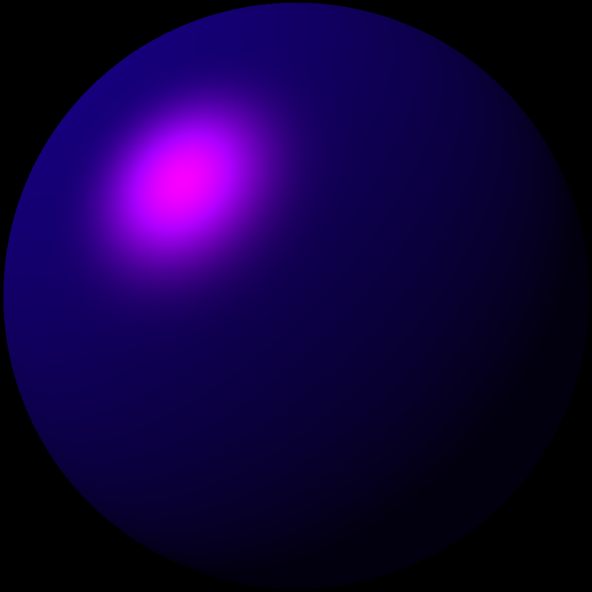

# RayTracer-C

Follow the book _The Ray Tracer Challenge_ to build a 3D renderer

## Build
1.`cmake && make`

The executables are placed in `bin`.
## Chapter 1 Tuples, Points, and Vectors
Projectile cannon test: `src/cannon_test`

## Chapter 2 Drawing on a Canvas
I implemented a simple char canvas, in OOP style.
`src/canvas/canvas.h`
Tried `ncurses`, maybe later for more sophisticated usage.

## Chapter 3 Matrices
Currently using Apple's `simd` library.

## Chapter 4 Matrix Transformations
`src/geometry/transform.h`
- Scaling
- Translate
- Shearing

## Chapter 5 Ray-Sphere Intersections
`src/geometry/sphere.h` and `src/ray/`

## Chapter 6 Light and Shading
- `src/lights/`: Light struct and `lignting` function 
- `src/colors/`: RGB to Luma conversion
- `src/canvas/`: `writeLumaPixels` write char according to converted Luma index.
- `src/ray_test.c`: Light rendering on the sphere.

## Chapter 7 Making a scene
- `src/world/`: A world and currently necessray methods
